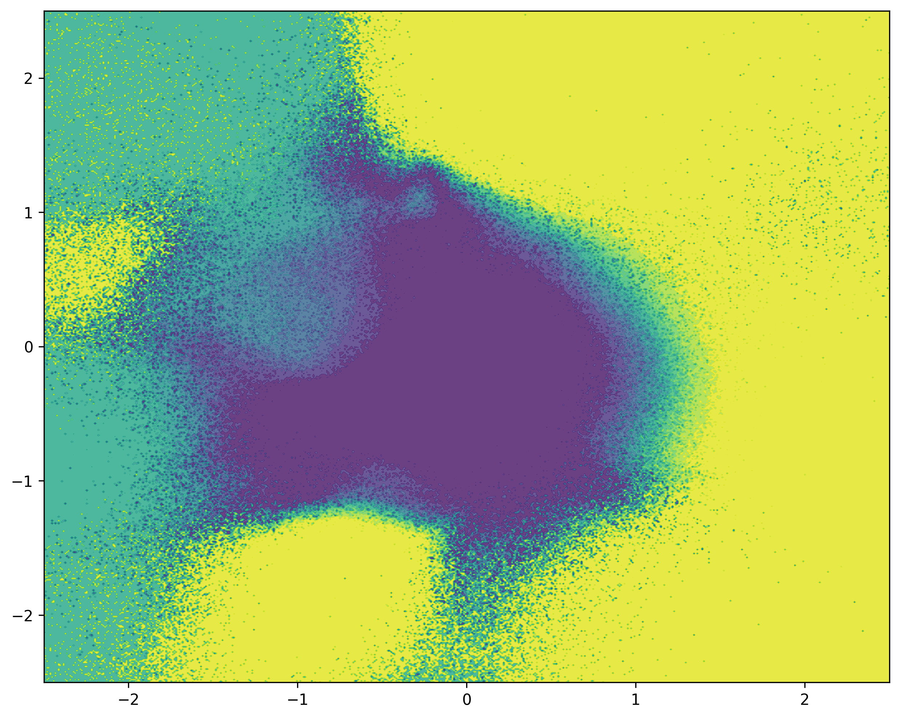

# Chapter 2 - Gradient Descent

This chapter explores the local loss landscape of a trained neural network by perturbing model parameters along two random, normalized directions and evaluating the loss on a 2D grid.

## Important Context

The model used here is not trained in this chapter.
It comes from another project: a CNN regressor that learns to predict how much of a cube is visible in an image.

In other words, this folder uses an already trained checkpoint and visualizes its loss surface.

## Files

- `main.py`: Loads the checkpoint, perturbs parameters, computes losses, and creates the contour plot.
- `model.py`: Defines the simple CNN regressor architecture.
- `utils.py`: Contains image preprocessing used for inference.
- `checkpoint.pt`: Trained model state used for the visualization.
- `loss_surface.png`: Saved output plot generated by `main.py`.

## Loss Surface



The figure shows how the MSE loss changes when moving away from the trained parameters in two random directions.

## Run

From this directory:

```bash
python main.py
```

This will regenerate `loss_surface.png`.
