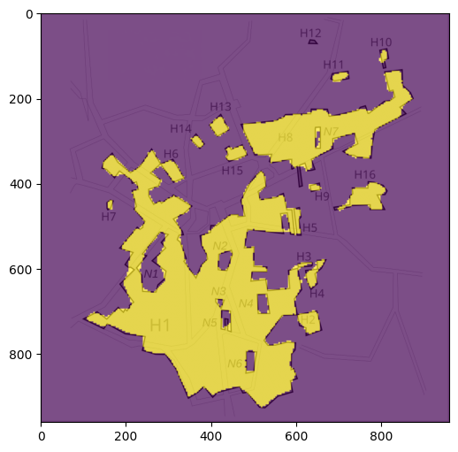

# Chapter 4 - Deep Learning

This chapter tackles the "100 Neuron Challenge": train a neural network with fewer than 100 hidden neurons to classify map coordinates with very high accuracy.

The dataset comes from Baarle-Nassau / Baarle-Hertog map regions, and the model learns to separate Belgium and Netherlands regions from 2D coordinates.

## Files

- `100_neuron_challenge.ipynb`: Main notebook containing the full pipeline (data loading, model design, training, evaluation, and visualization).
- `checkpoint.pt`: Saved model checkpoint for the trained network.
- `data/`: Input image data used to create training points.

## What This Chapter Shows

- How to convert image regions into labeled coordinate data.
- How architecture depth and width trade off under a neuron budget.
- Why skip connections and layer normalization help gradient flow in deeper MLPs.
- How to compare multiple architectures and visualize their loss, accuracy, and gradient behavior.
- How to visualize the final decision boundary on top of the map.

## Final Result

The notebook trains and evaluates multiple candidate architectures and settles on a compact model that reaches an accuracy above `0.995`.

A trained checkpoint is stored in `checkpoint.pt`, and the final decision boundary visualization is generated in the notebook with `viz_decision_boundary(model)`.

Final model summary:

- Architecture used for the final run: `5` hidden layers with `19` neurons per layer.
- Achieved sample accuracy: `> 0.995`.
- Saved model artifact: `checkpoint.pt`.

Final decision boundary (accuracy > 0.995):



## Run

Open and run the notebook from this folder:

```bash
jupyter notebook 100_neuron_challenge.ipynb
```

Or open it directly in VS Code and run all cells.

## Dependencies

- Python 3.x
- NumPy
- PyTorch
- Matplotlib
- OpenCV (`opencv-python`)

Install dependencies if needed:

```bash
pip install numpy torch matplotlib opencv-python
```
