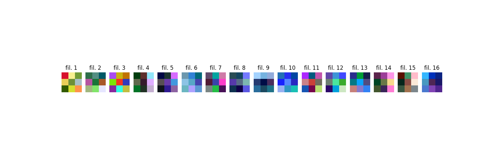
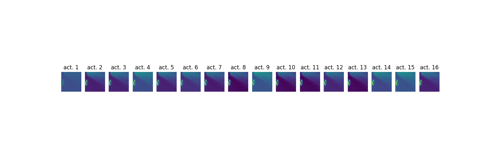

# Chapter 5 - AlexNet

This chapter explores feature visualization on a trained AlexNet-based regressor.
It shows both learned first-layer filters and first-layer activations for an example image.

## Key Results

The two visualizations below are the main outputs of this chapter and should be read first.

### First-Layer Filters (`filters.png`)



### First-Layer Activations (`activations.png`)



## Important Context

The model checkpoint used here is loaded from the shared folder:

- `../Cube Detection model/checkpoint.pt`

That checkpoint originates from the cube detection project source:

- https://github.com/Waser2004/Athena-Robot-AI

## Files

- `feature_visualisation.py`: Loads the shared checkpoint, visualizes first convolution filters, and visualizes first-layer activations for `example.png`.
- `filters.png`: Saved output image containing visualized first-layer filters.
- `activations.png`: Saved output image containing activation maps.

## Run

From this directory:

```bash
python feature_visualisation.py
```

The script will regenerate `filters.png` and `activations.png`.
